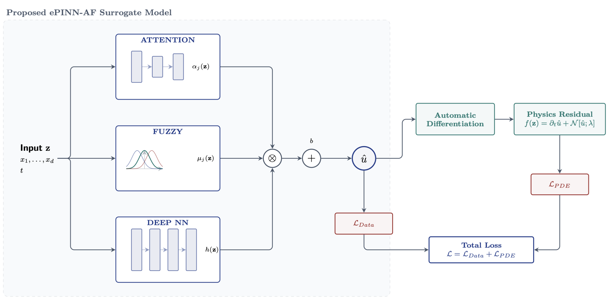

<div align="center">

# ePINN-AF

### Enhanced Physics-Informed Neural Networks with Attention–Fuzzy Logic

*A drop-in PINN architecture that mitigates spectral bias and gradient pathologies
by adaptively partitioning the input domain through soft fuzzy rules and
softmax attention.*

[](LICENSE)
[](https://www.python.org/)
[](https://pytorch.org/)
[]()
[]()

<br/>



</div>

---

## Table of Contents

1. [Why ePINN-AF?](#why-epinn-af)
2. [Method at a glance](#method-at-a-glance)
3. [Repository structure](#repository-structure)
4. [Installation](#installation)
5. [Quick start](#quick-start)
6. [Benchmarks](#benchmarks)
7. [How it works (deeper dive)](#how-it-works-deeper-dive)
8. [Reproducing the paper](#reproducing-the-paper)
9. [Diagnostics](#diagnostics)
10. [Citation](#citation)
11. [Contact](#contact)
12. [Acknowledgments](#acknowledgments)
13. [License](#license)

---

## Why ePINN-AF?

Physics-Informed Neural Networks (PINNs, Raissi et al. 2019) are an elegant
framework for solving PDEs: parameterize the solution by an MLP, take
analytic derivatives via autograd, and minimize the residual at collocation
points. In practice three well-documented pathologies make plain PINNs fragile:

| Pathology                                | Symptom                                                                                       | Fix in ePINN-AF                                                                 |
| ---------------------------------------- | --------------------------------------------------------------------------------------------- | ------------------------------------------------------------------------------- |
| **Spectral bias**                        | Network learns low-frequency components and ignores high-frequency residuals (NTK eigen gap). | Per-rule heads `h_j(z)` over a shared backbone give each rule its own spectrum. |
| **Gradient pathologies** (Wang et al. 2021) | ‖∇θ L_pde‖ ≫ ‖∇θ L_data‖, optimisation stalls in the residual term.                          | Soft fuzzy gating `γ_j = α_j·μ_j` localizes residual gradients per region.      |
| **Multi-regime / stiff problems**        | One MLP must fit pre-shock + post-shock or several disparate length-scales simultaneously.    | Fuzzy rules partition the input space; attention selects which rules fire where. |

ePINN-AF keeps the **same loss form** as a standard PINN
(`L = MSE_data + MSE_pde`, no adaptive weights, no curriculum) and addresses
the above purely through the architecture. The architectural cost is modest
— a few extra hundred parameters for the attention sub-net and `M` fuzzy
heads — and the training pipeline (Adam → L-BFGS) is identical.

---

## Method at a glance

For an input `z ∈ ℝ^d` (e.g. `(x, t)` or `(x, y, t)`), the network outputs

```
û(z)  =  Σ_{j=1}^{M}  α_j(z) · μ_j(z) · h_j(z; θ_h)   +  b
       └─────────┬───────────┘└──────┬──────┘
            adaptive gate     per-rule head
```

where

| Symbol           | Definition                                                                                | Role                                              |
| ---------------- | ----------------------------------------------------------------------------------------- | ------------------------------------------------- |
| `μ_j(z)`         | `exp(-½ Σᵢ ((zᵢ - c_{ji}) / σ_{ji})²)`                                                    | Soft Gaussian rule over the input domain          |
| `α_j(z)`         | `softmax_j(W₂ · tanh(W₁ z + b₁) + b₂)`                                                    | Attention weights — what each rule should focus on |
| `γ_j(z)`         | `μ_j(z) · α_j(z)`                                                                         | Combined gating per rule                          |
| `h(z; θ_h)`      | MLP backbone, tanh on every hidden layer                                                  | Shared latent features                            |
| `h_j(z)`         | `W_j · h(z)`                                                                              | Per-rule projection of the shared features        |
| `b`              | Trainable output bias                                                                     | —                                                 |

The fuzzy centers `c_j` and widths `σ_j` are **learnable** — the network
discovers where to place its rules. With `M = 4–16` rules ePINN-AF already
matches or beats much larger plain PINNs on every benchmark in this repo.

Two optional switches (off by default for 1-D PDEs, on for Navier-Stokes):

- **`partition_dims`** — restrict `μ_j` to a subset of input axes.
  Example: `partition_dims=[2]` on a `(x, y, t)` problem makes rules localize
  along time only, ideal for periodically-shedding flows.
- **`use_direct_head`** — adds a parallel `W_d · h(z)` path that bypasses
  the fuzzy gate. Guarantees a clean gradient highway and helps on
  multi-output problems.

---

## Repository structure

```
ePINN-AF/

```

---

## Installation

```bash
git clone https://github.com/<amiin10>/ePINN-AF.git
cd ePINN-AF
python -m venv .venv && source .venv/bin/activate   # optional
pip install -r requirements.txt
```

Tested with Python 3.9–3.12, PyTorch ≥ 2.0 on both CPU and CUDA.
A single mid-range GPU (e.g. T4, 3060) is enough for every experiment;
runtime per script ranges from ~3 minutes (Burgers) to ~40 minutes
(Navier-Stokes with 20 000 Adam iterations).

### Datasets

Four `.mat` files are needed (Burgers, Allen-Cahn, KdV, Navier-Stokes).
The Poisson experiments use an analytical solution and need no data. See
[`datasets/README.md`](datasets/README.md) for the download links.

```
datasets/
├── README.md
├── burgers_shock.mat
├── AC.mat
├── KdV.mat
└── cylinder_nektar_wake.mat
```

---

## Quick start

Each PDE folder contains one or more `train_*.py` scripts. They are
self-contained — pick one and run it:


The training script saves a pickle (e.g. `burgers_base_results.pkl`) with
the prediction, reference, errors, loss history, and configuration. The
matching `plot_*.py` script consumes that pickle and renders a 4-panel
figure: reference, prediction, absolute error, and loss curve.

### Using the model in your own code

The package is small and unopinionated:

```python
import torch
from ePINN_AF import AFPINN, seed_torch, get_device

seed_torch(0)
device = get_device()

model = AFPINN(
    input_dim       = 2,                       # e.g. (x, t)
    backbone_layers = [200, 200, 200, 200],    # tanh on every hidden layer
    n_rules         = 8,                       # M fuzzy rules
    attn_hidden     = 64,                      # width of attention sub-net
    output_dim      = 1,                       # scalar PDE
    lb              = [-1.0, 0.0],             # domain bounds (for normalization)
    ub              = [ 1.0, 1.0],
).to(device)

u_hat = model(torch.randn(128, 2, device=device))   # [128, 1]
```

You only need to pair it with a PDE-specific residual (typically a handful
of `torch.autograd.grad` calls) and an optimizer. See any of the
`train_*.py` scripts for a complete, minimal template.

---

## Benchmarks

> The numbers below are *representative* values from the configurations in
> this repo; exact figures depend on hardware, PyTorch version, and seed.
> All errors are relative L² unless otherwise noted.

| PDE                        | Script (this repo)                         
| -------------------------- | ------------------------------------------ 
| Burgers                    | `Burgers/train_burgers_base.py`            
| Allen-Cahn                 | `AllenCahn/train_ac_base.py`               
| KdV                        | `KdV/train_kdv_base.py`                    
| Poisson 2-D                | `Poisson/train_poisson_2d.py`              
| Poisson 3-D                | `Poisson/train_poisson_3d.py`              
| NS cylinder wake — `u`     | `NavierStokes/train_ns_time_partition.py`  
| NS cylinder wake — `v`     | (same)                                     
| NS cylinder wake — `p`     | (same)                                     

Refer to the manuscript for head-to-head comparisons against  PINN,
APINN, FPINN, SA-PINN and CausalPINN under identical settings.

---

## How it works (deeper dive)

**The trick is in `γ_j(z) = α_j(z) · μ_j(z)`.**

The fuzzy term `μ_j(z)` is *spatially* local — it lights up only where the
input is close to the rule's learned center `c_j`. The attention term
`α_j(z)` is *content-driven* — it can suppress or amplify a rule based on
the full input. Their product gives a soft, learnable partition of the
input space:

- In smooth regions where one rule's center is dominant, that rule's head
  `h_j(z)` carries the prediction.
- Near sharp features (shocks, interfaces, vortices), several rules can
  overlap and their weighted sum captures the local behaviour at higher
  effective resolution than a single MLP.

Because the gating is fully differentiable, gradients flow back into the
centers `c_j`, widths `σ_j`, attention weights, backbone parameters, and
per-rule heads all at once. There are **no auxiliary losses, no manual
weight tuning, no curriculum**.

**Spectral bias.** The per-rule heads `h_j(z) = W_j · h(z)` give each rule
its own linear projection of the backbone features. In the NTK regime this
amounts to widening the effective spectral support of the network: rather
than `K_uu` being a single rank-D kernel, it becomes a mixture of M
rank-D kernels selected per location by `γ_j`. The result is a flatter NTK
eigenvalue decay and a lower condition number, both of which correlate
with the residual term being well-conditioned (Wang, Wang & Perdikaris,
2022).

---

## Reproducing the paper

The training scripts in this repo are simplified to make ePINN-AF easy to
read and re-use. The original full-experiment scripts (including baselines
PINN/APINN/FPINN/SA-PINN/CausalPINN and the editor-requested diagnostics)
were used to produce the manuscript's tables and figures. Those baseline
codes are not included here — this repository is focused on the proposed
method only.

If you would like the comparison scripts, please open an issue or contact
the author (see [Contact](#contact)).

---

## Diagnostics

`ePINN_AF.utils` also exposes the three diagnostic toolkits used in the
paper's rebuttal section. They depend only on a `wrapper` exposing
`model`, `loss_fn`, `net_u`, `net_f` (and optionally `checkpoints`):

```python
from ePINN_AF import (
    split_grad_norms,              # Wang-Teng-Perdikaris (2021) gradient flow
    per_layer_grad_stats,
    loss_landscape_1d,             # Li et al. (2018) filter-normalised
    loss_landscape_2d,
    compute_ntk_kernels,           # PINN-NTK (Wang, Wang & Perdikaris, 2022)
    evaluate_ntk_at_checkpoints,
)
```

These are not enabled by default in the streamlined per-PDE scripts to
keep the runtime short. See the docstrings in `ePINN_AF/utils.py` for
how to wire them in.

---

## Citation

If you use this code in your research, please cite both the software and
the paper. The GitHub "Cite this repository" button reads from
[`CITATION.cff`](CITATION.cff).

```bibtex

```

---

## Contact

**Aminhosseini**
✉ &nbsp; *[amin.hosseini1@aut.ac.ir]*  &nbsp; 

🐙 &nbsp; [github.com/Amiin10](https://github.com/amiin10)

🔬 &nbsp; *Department of Mechanical Engineering, Amirkabir University of Technology (Tehran Polytechnic)*

Bug reports, feature requests, and questions are very welcome via
[GitHub Issues](https://github.com/amiin10/ePINN-AF/issues).

---

## Acknowledgments

- The benchmark datasets (`burgers_shock.mat`, `AC.mat`, `KdV.mat`,
  `cylinder_nektar_wake.mat`) come from the original PINN and HFM
  repositories by Maziar Raissi and collaborators.
- The gradient-flow diagnostic follows Wang, Teng & Perdikaris (2021,
  *Understanding and mitigating gradient flow pathologies in physics-informed
  neural networks*).
- The filter-normalised loss-landscape visualization follows Li, Xu, Taylor,
  Studer & Goldstein (2018, *Visualizing the Loss Landscape of Neural Nets*).
- The PINN-NTK decomposition follows Wang, Wang & Perdikaris (2022, *When
  and why PINNs fail to train: a Neural Tangent Kernel perspective*).

---

## License

This project is released under the [MIT License](LICENSE).
The benchmark datasets remain under their original licenses; please
refer to the upstream repositories listed in
[`datasets/README.md`](datasets/README.md).

---

<div align="center">

*Built with ❤ for the scientific-machine-learning community.*

</div>
